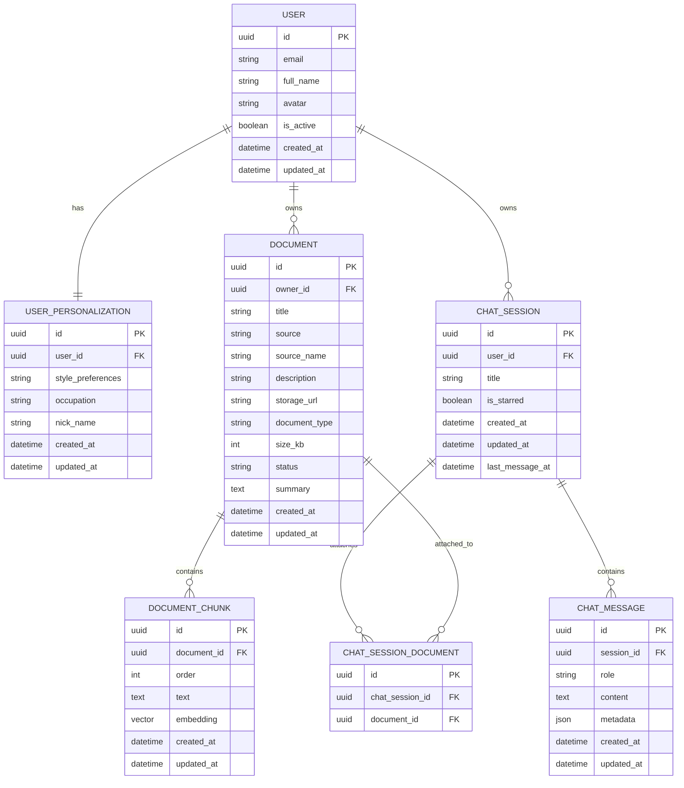
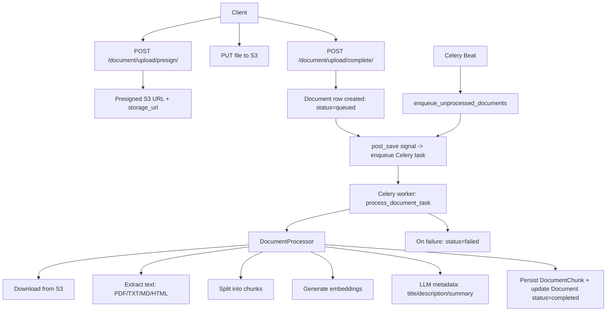
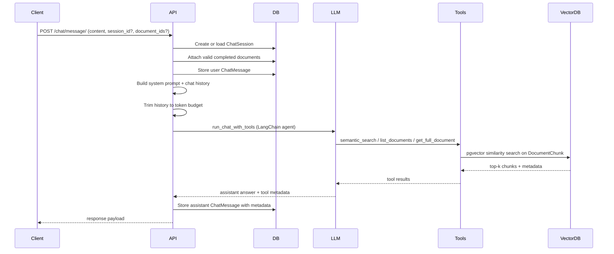

# Ruggi (RAG Chat) Backend Architecture

This document describes the backend architecture for the Rag Chat project ("Ruggi"), focusing on data model, API flows, document processing, and chat response orchestration. It is written to support technical interviews and deep dives.

## 1. System Overview

### Core components

- Django API (apps/api) serving REST endpoints for auth, user profile, documents, and chat.
- PostgreSQL database with pgvector for semantic search embeddings.
- Celery workers for background document processing.
- Celery Beat for periodic retries of queued documents.
- AWS S3 for document storage and presigned upload/download.
- OpenAI APIs (LLM and embeddings) via LangChain.

### Request lifecycle (high level)

- Client authenticates via Google OAuth, uses session cookies.
- Documents are uploaded to S3 with a presigned URL and queued for background processing.
- Document processing extracts text, chunks it, embeds each chunk, and stores metadata + embeddings.
- Chat uses a tool-augmented LLM to retrieve context via vector search and respond with grounded answers.

## 2. Data Model (Postgres + pgvector)

Notes:

- `DOCUMENT_CHUNK.embedding` is a pgvector column (256-dim) used for semantic search.
- `CHAT_SESSION_DOCUMENT` is the implicit many-to-many join table created by Django for session attachments.

## 3. API Surface (Key Endpoints)

### Auth

- `POST /auth/google/login-url/` -> returns OAuth URL
- `GET /auth/google/callback/` -> OAuth callback, session login
- `POST /auth/logout/` -> logout

### User

- `GET /user/` -> profile
- `PUT/PATCH /user/update/` -> update profile + personalization
- `DELETE /user/delete/` -> delete account

### Documents

- `GET /document/` -> list documents
- `POST /document/upload/presign/` -> S3 presigned upload URL
- `POST /document/upload/complete/` -> create queued document record
- `GET /document/<id>/` -> document detail with chunk previews
- `PUT/PATCH /document/<id>/update/` -> update title/description
- `DELETE /document/<id>/delete/` -> delete document + S3 object

### Chat

- `POST /chat/message/` -> create user message + run LLM
- `GET /chat/session/` -> list sessions
- `GET /chat/session/<id>/` -> session detail + messages
- `PUT/PATCH /chat/session/<id>/update/` -> update title/starred
- `DELETE /chat/session/<id>/delete/` -> delete session
- `POST /chat/session/<id>/title/` -> generate title

## 4. Document Processing Architecture

### Flow (upload to processed)

### Processing Design Details

- The upload is a two-step flow to keep large files out of the API server.
- Processing is asynchronous and idempotent. If a document is already processing/completed, duplicate tasks are skipped.
- The processor deletes old chunks before re-writing, ensuring chunk order consistency.
- Errors during processing mark the document as `failed` with logs.
- Celery Beat re-enqueues stale queued documents every 2 minutes (safety net).

## 5. Chat Response Architecture (RAG)

### Flow (message to response)

### Chat Design Details

- The system prompt includes a document catalog and tool instructions.
- Tooling is constrained to attached documents if any are provided.
- Semantic search uses pgvector cosine similarity on chunk embeddings.
- The response metadata stores tool usage, chunk IDs, and attached document IDs.
- History is trimmed based on actual token counts using `tiktoken`.

## 6. Background Jobs and Scheduling

- `document.process_document` (Celery task): processes a specific document.
- `document.enqueue_unprocessed_documents` (Celery Beat): every 2 minutes, enqueues queued documents older than 1 minute.

## 7. Security and Authorization

- Auth is handled via Google OAuth and Django sessions.
- Document access is always scoped to the authenticated user.
- Chat sessions are user-owned; invalid or unauthorized session access is rejected.

## 8. External Dependencies

- AWS S3: document storage and presigned uploads.
- PostgreSQL + pgvector: persistent storage and vector similarity search.
- OpenAI (via LangChain): chat completion and embeddings.
- Redis: Celery broker and result backend.

## 9. Operational Notes

- If `OPENAI_API_KEY` is missing, document processing and chat will fail fast.
- Document types supported: PDF, TXT, MD, HTML.
- Upload size limit: 10 MB.
- Vector embedding dimension: 256.
