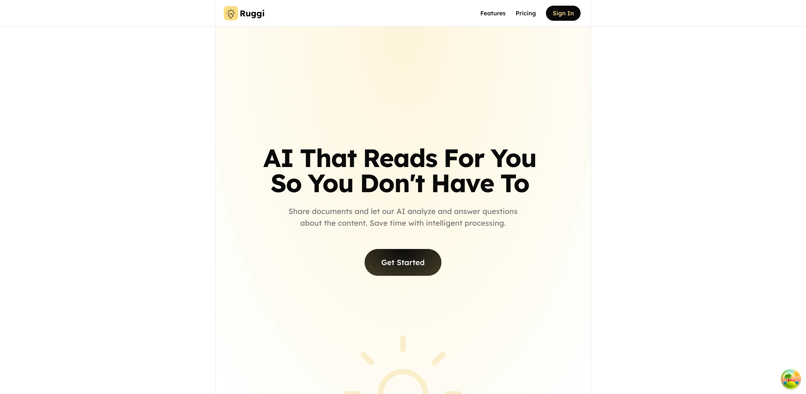
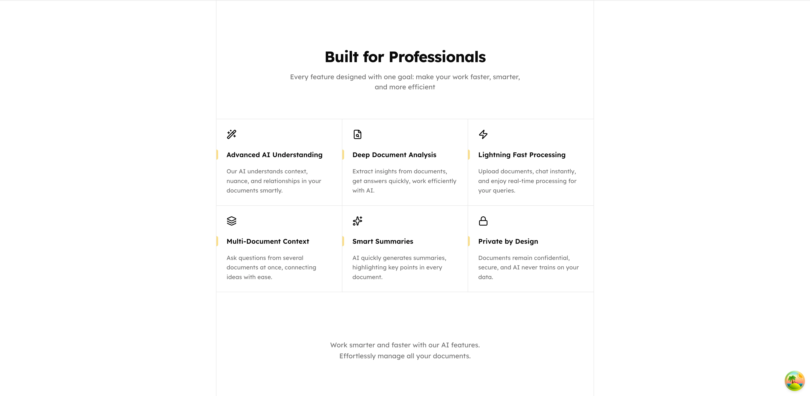
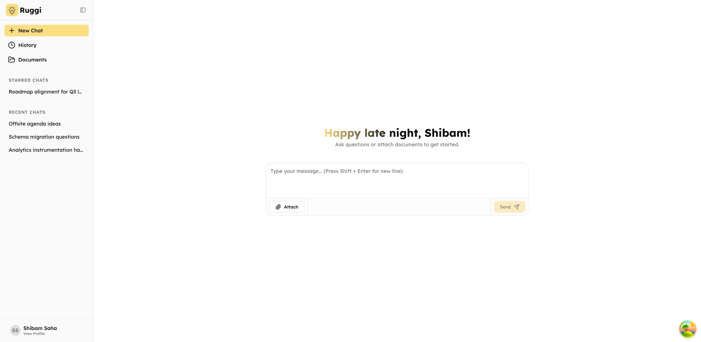
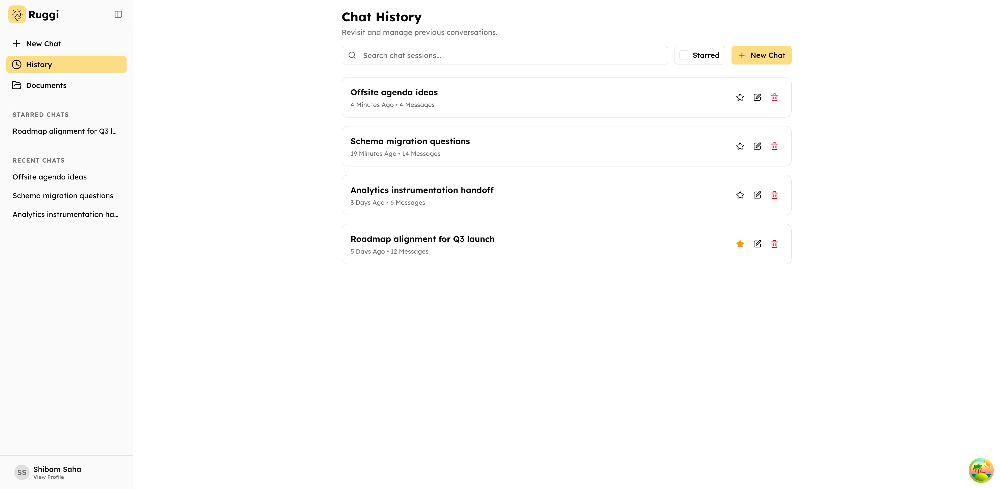
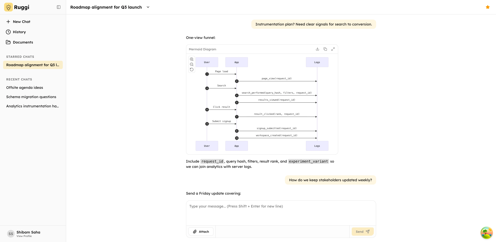
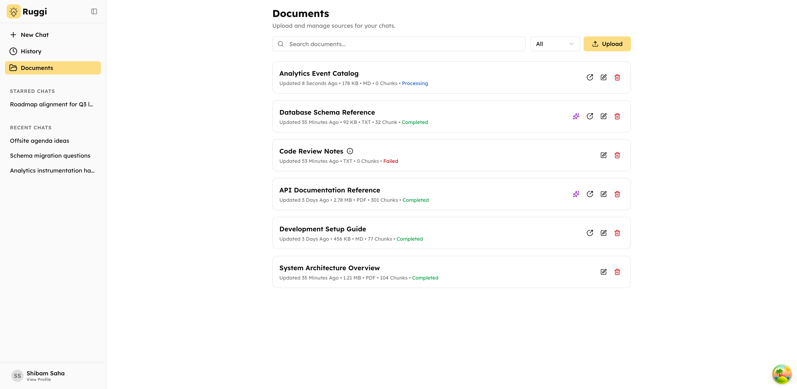
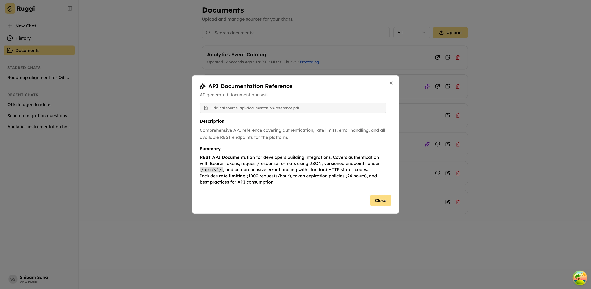

    

    <h1>Ruggi</h1>
    
AI That Reads For You, So You Don't Have To

    
    
    

 

## ⚡ Introduction

Ruggi is an AI-powered chat app that reads your documents so you don’t have to. Upload files, then chat naturally to get instant answers, summaries, and insights from their contents. Ruggi securely processes your data and helps you extract important information quickly and easily from your own documents.

## ✨ Features

- Upload documents in multiple formats including PDF, text files, markdown, and HTML
- Chat with an AI assistant that reads and understands your documents, answering questions with context from your files
- Ask questions across multiple documents at once, connecting ideas and insights from different sources
- Get instant summaries of your documents highlighting the most important points and key information
- Organize your conversations with custom titles, star important chats, and browse your full chat history
- Personalize your experience with custom preferences, occupation details, and communication style settings
- Track your document processing status in real-time so you know when your files are ready to chat about

## ⚙️ Tech Stack

- React.js
- Vite
- TypeScript
- Django REST Framework
- PostgreSQL
- Python
- LangChain
- OpenAI
- TanStack Query
- TanStack Router
- Tailwind CSS
- AWS S3

## 📦 Other Libraries and Tools

- Docker
- Celery
- Redis
- LangGraph
- Biome
- Ruff
- pgvector

## 🎯 Goals

- [x] Build a robust document processing pipeline with asynchronous background jobs using Celery
- [x] Build a RAG system with semantic search using pgvector and OpenAI embeddings
- [x] Create a chat interface with tool-augmented LLM using LangChain and LangGraph
- [x] Build a document storage solution with AWS S3 presigned URLs for secure uploads
- [x] Build a modern frontend with TanStack Router and Query
- [x] Implement authentication with Google OAuth and Django sessions
- [x] Build a document chunking and embedding system for semantic search

## 🖼️ Screenshots

## 👋🏻 Contact

